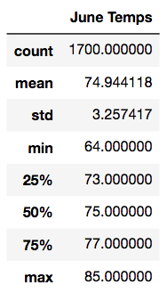

# Oahu June vs. December Temperature Analysis

## Overview

The following analysis is a comparison of June and December temperatures for the island of Oahu undertaken to determine the year-round stability of a proposed surf and ice cream shop under the assumption that such a shop would not be sustainable in cold weather. 

## Results

The analysis showed December temperatures to be cooler than those in June, as expected. Some key
points taken from the analysis are as follows:

    * The average temperature for June was about 4 degrees warmer than December (74.94 vs 71.04 degrees)
    * Temperature varied slightly more in December than June (standard deviation 3.75 vs 3.26)
    * The minimum temperature for was December was 8 degrees lower than the minimum June temperature (56 vs 64 degrees) 

Summary statistics for the temperatures of both months are shown below:

 

## Summary

In conclusion, while it can be said that it is in fact cooler on Oahu in December, it is only on average four degrees cooler than in June, and on most December days could very well be surf and ice cream weather. Indeed, 50% of temperature observations in December are over 71 degrees. In order to better understand and compare June and December temperatures, it would be beneficial to write a query that analyzed both June and December temperatures by year, so as to check whether any of the years included in the data set are possible outliers that in turn skew the summary statistics of the combined analysis for all June or December dates. Another useful query would be to group observations by weather station to zero in on geographical temperature differences on Oahu in order to avoid opening the surf and ice cream shop in a cooler area of the island. 
